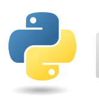
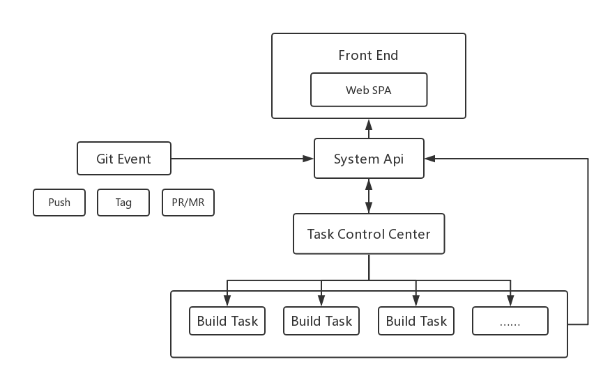
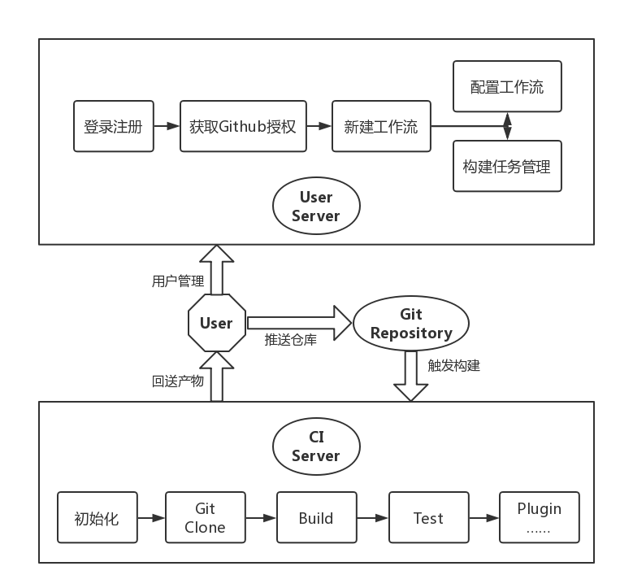
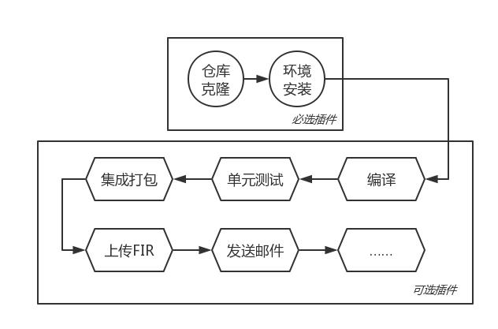
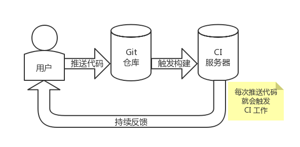

# EasyCI 整体架构

## 技术选型

</img>
</img>
</img>

<b>前端（Angular） + 后端（Java Spring Boot） + 插件（Python）</b>

- EasyCI 前端通过流行的 Angular 框架实现了一套基于浏览器的单页应用 (SPA - Single Page Application)
- EasyCI 后端通过基于 Java 平台的轻量级框架 Spring Boot 实现了一套 RESTful 风格的 API
- EasyCI 插件系统通过 Python 脚本的形式实现

## 整体架构

## 系统工作流程

## 工作流示例

## 何以持续

   

    <a href="./README.md">返回目录首页</a>

 

    <a href="./intro_base.md">上一节：EasyCI 简介</a>
    &nbsp;&nbsp;|&nbsp;&nbsp;
    <a href="./intro_ci_unit_test.md">下一节：有关「CI」及「单元测试」</a>

<link rel="stylesheet" rev="stylesheet" href="./assets/css/easy-ci.css" type="text/css"/>