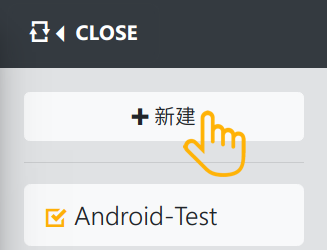
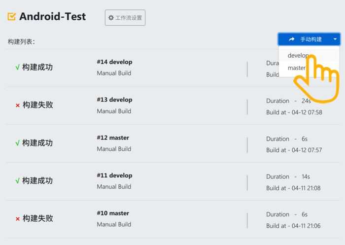
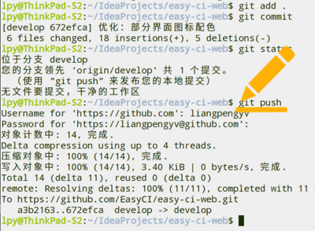
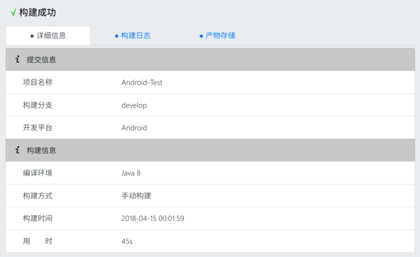
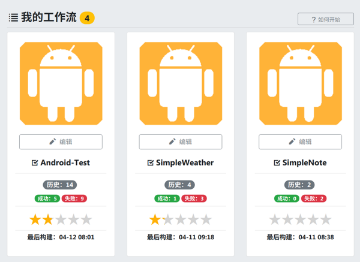

# Android 项目构建

## （零）环境准备

> 对于私有部署，EasyCI 并没有集成 Gradle 和 Android SDK，需要用户手动在您的 CI 服务器上安装。

- [安装 Gradle](https://gradle.org/) 并将 gradle 添加到 PATH 环境变量中，运行 `gradle -v` 检测是否配置成功；

- [安装 Android SDK](https://developer.android.com/studio/index.html?hl=zh-cn) 并将 SDK 部署在用户目录下的并重命名为 `.AndroidSdk`，即形如：`$HOME/.AndroidSdk/……`，以保证我们的初始化插件脚本能够扫描到 Android SDK 环境。

## （一）创建

创建 Flow 并配置工作流

- 点击左上角「工作流」，选择「新建」

- 填写项目名称，选择 Git 仓库源，勾选出发构建的分支

- 基于在线插件，配置需要的工作流

- 根据提示填写插件参数

## （二）触发

可手动触发第一次构建

- 点击「手动构建」按钮

- 选择要构建的分之

- 稍等片刻，构建任务就会开始运行

- 运行中可随时点击对应任务查看详情

日常可通过 `git push` 触发自动构建

- 正常进行开发工作，完成一个小任务

- 本地提交并 push 到远程仓库

- 远程仓库会通过 WebHook 通知我们的 CI 系统

- EasyCI 触发器收到通知，按照预先配置开始构建

## （三）查看

查看具体任务构建详情

- 进入某一工作流的构建列表

- 点击具体的构建任务，进入对应构建详情

- 可看到构建状态/结果以及详细的构建信息

- 点击其它标签查看构建日志及构建产物

还可通过仪表板查看整体构建情况

- 点击顶部标题栏中央 Logo，回到首页

- 登录状态下会进入「仪表板」视图

- 这里综合展示了所有工作流的整体构建情况

- 包括构建历史、成功失败数、代码质量评级等

   

    <a href="./README.md">返回目录首页</a>

 

    <a href="./install_plugin.md">下一节：EasyCI 插件系统的部署</a>
    &nbsp;&nbsp;|&nbsp;&nbsp;
    <a href="./other_question.md">下一节：常见问题</a>

<link rel="stylesheet" rev="stylesheet" href="./assets/css/easy-ci.css" type="text/css"/>